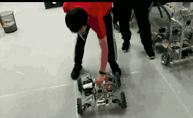

# 步兵底盘小陀螺的实现
我第一次看见小陀螺的时候是在去年比赛的佛山分区赛，当时我的比赛已经彻底结束了，在备场区看比赛直播，看见了有个战队的步兵可以**360度**旋转，还可以同时实现底盘的前后左右移动，当时死活想不通是怎么实现的。

昨天逛空间的时候再次看见了这种小陀螺，跑的确实欢快，心里非常羡慕，于是今天下午决心要实现小陀螺。

但没想到稍微一想就有些思路了，其实就是一个运动的分解与合成，在此记录一下。

首先看看之前的步兵车底盘的基本运动计算方程：
```c
m3508_1.speed_pid.ref = infantry.chassis.FBSpeed + infantry.chassis.LRSpeed + infantry.chassis.RotateAngle;
m3508_2.speed_pid.ref = -infantry.chassis.FBSpeed + infantry.chassis.LRSpeed + infantry.chassis.RotateAngle;
m3508_3.speed_pid.ref = -infantry.chassis.FBSpeed - infantry.chassis.LRSpeed + infantry.chassis.RotateAngle;
m3508_4.speed_pid.ref = infantry.chassis.FBSpeed - infantry.chassis.LRSpeed + infantry.chassis.RotateAngle;
```
从上面的代码可以看出，整个底盘是由前后运动、左右运动和旋转运动三种运动合成的，就像声波传输一样，多种波可以叠加在一起并互不影响。

明白了这一点就很简单了，一张图就能讲解清楚。

从上图可以看出，只要获取到了当前云台与底盘的夹角$$\alpha$$，$$V_x$$和$$V_y$$是遥控器给的指令，$$v_x$$和$$v_y$$是相对于底盘正方向的前后左右速度。
<center></center>
它们之间存在以下的关系：

$$v_x = V_x \times cos(\alpha) + V_y \times sin(\alpha)$$

$$v_y = -V_X \times sin(\alpha) + V_y \times cos(\alpha)$$

那么这个$$\alpha$$角度怎么获取呢？我使用了步兵车的yaw轴电机获取当前的角度差。代码如下：
```c
angle = yaw_motor.fdbPosition - infantry.gimbal.YawBiasAngle;
if(angle < 0)
{
  angle += 8192;
}
angle = angle * 0.00076f;
```
这里我遇到一个坑，我在[菜鸟教程](http://www.runoob.com/try/runcode.php?filename=helloworld&type=c)的C语言在线编译器上执行三角函数，发现三角函数是以角度值计算的，结果电机各种抖动，后来才发现在keil中三角函数是以弧度值计算的。

所以angle的转换系数为
$$\frac{2\pi}{8192}=0.00076$$

最后附上我的代码：
```c
float angle;
int FBSpeed;
int LRSpeed;

FBSpeed = (Remote.rc.ch1 - CH0_BIAS);
LRSpeed = (Remote.rc.ch0 - CH1_BIAS);
infantry.chassis.RotateAngle = 1800;

angle = yaw_motor.fdbPosition - infantry.gimbal.YawBiasAngle;
if(angle < 0)
{
  angle += 8192;
}
angle = angle * 0.00076f;

infantry.chassis.FBSpeed = (float)FBSpeed * cos(angle) + (float)LRSpeed * sin(angle);
infantry.chassis.LRSpeed = (float)FBSpeed * -sin(angle) + (float)LRSpeed * cos(angle);

m3508_1.speed_pid.ref = infantry.chassis.FBSpeed + infantry.chassis.LRSpeed + infantry.chassis.RotateAngle;
m3508_2.speed_pid.ref = -infantry.chassis.FBSpeed + infantry.chassis.LRSpeed + infantry.chassis.RotateAngle;
m3508_3.speed_pid.ref = -infantry.chassis.FBSpeed - infantry.chassis.LRSpeed + infantry.chassis.RotateAngle;
m3508_4.speed_pid.ref = infantry.chassis.FBSpeed - infantry.chassis.LRSpeed + infantry.chassis.RotateAngle;
```
实际的步兵车底盘小陀螺运动效果展示
<center></center>