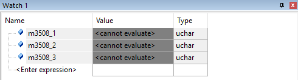

#keil选择性编译那些事儿
今天遇到个非常奇葩的问题，我首先定义了四个全局变量`m3508_1`，`m3508_2`，`m3508_3`，`m3508_4`。
```c
struct CAN_Motor
{
    int fdbPosition;        //电机的编码器反馈值
    int last_fdbPosition;   //电机上次的编码器反馈值
    int bias_position;      //机器人初始状态电机位置环设定值
    int fdbSpeed;           //电机反馈的转速/rpm
    int round;              //电机转过的圈数
    int real_position;      //过零处理后的电机转子位置
};

struct CAN_Motor m3508_1 = DEFAULT_MOTOR;    //底盘四个电机的数据存储结构体
struct CAN_Motor m3508_2 = DEFAULT_MOTOR;
struct CAN_Motor m3508_3 = DEFAULT_MOTOR;
struct CAN_Motor m3508_4 = DEFAULT_MOTOR;
```
初始化的时候也相应地初始化了结构体里面的成员变量。
```c
#define DEFAULT_MOTOR \
{0,0,0,0,0,0}
```
程序编译下来没有报错，但是下载进单片机后，把变量加入`watch`窗口查看，但是却是如下显示：
<center></center>
这明明是局部变量才会出现的提示啊！！

后面经过我自己的自闭后发现了一些规律：

首先我尝试写了一个函数，象征性地改变一下其中一个结构体的参数，然后在main函数中调用它：
```c
void test()
{
  m3508_1.fdbPosition = 1;
  m3508_2.fdbPosition = 1;
}
```
然后我再进入调试，奇迹就发生了！
<center></center>
四个结构体都可以查看了，而且我改变过的`m3508_1`和`m3508_2`两个结构体的数据均已经变为正常了，而剩下的两个未使用的结构体虽然能查看数据，但是数据全是错的。

到这里我基本就看出了一些端倪，然后我把`m3508_3`也加了进去：
```c
void test()
{
  m3508_1.fdbPosition = 1;
  m3508_2.fdbPosition = 1;
  m3508_3.fdbPosition = 1;
}
```
然后进入调试。
<center></center>
果然！`m3508_3`结构体也正常了！

从上面的实验可以看出，keil在编译工程文件的时候，会把没有使用到的变量、变量类型和函数都删除，如果变量初始化后但是没有使用，那么它的值就会是一个很奇怪的值*（偶尔会正常）*

最后，我把main函数里面的`test();`语句注释掉，最后调试结果也正如上面所分析的，这四个结构体都是不能查看的，因为keil压根就没有编译这些变量。