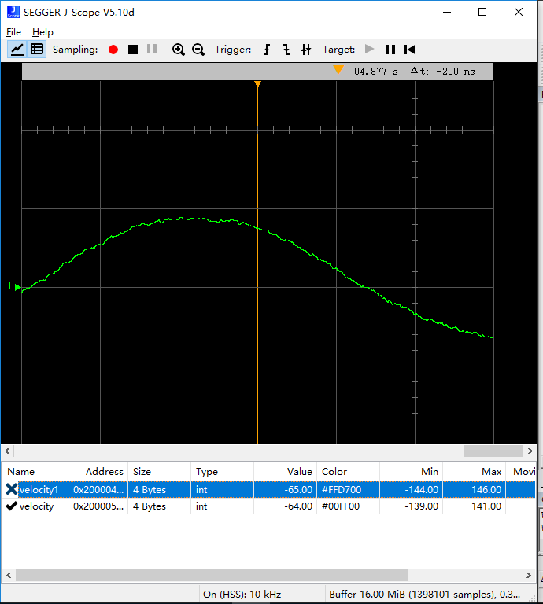
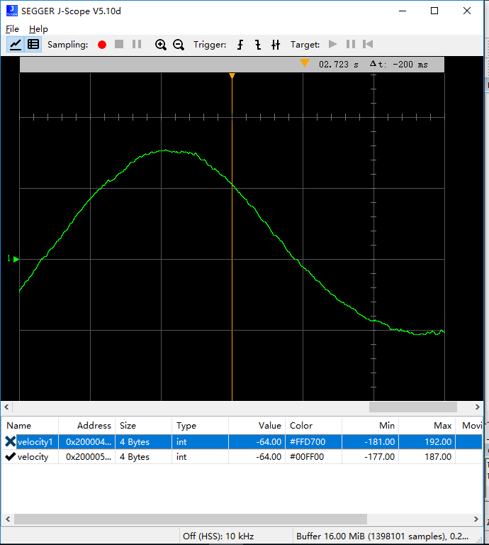
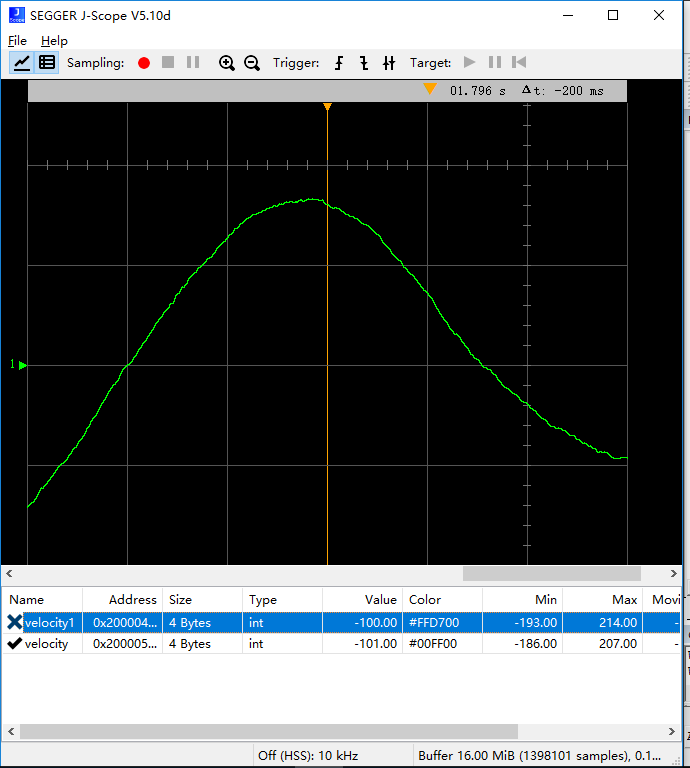
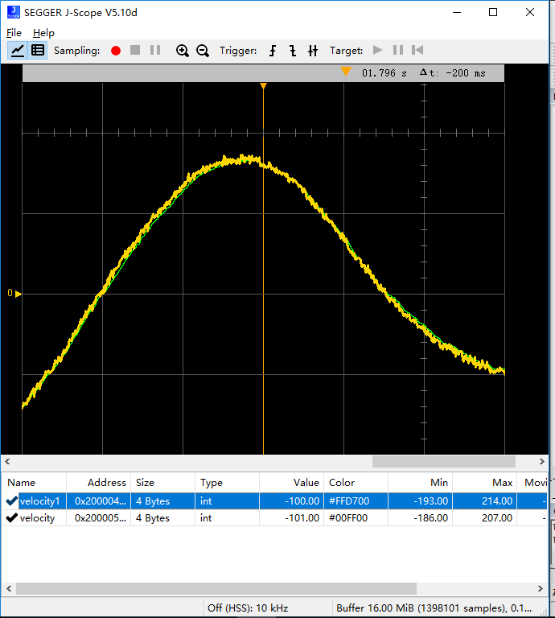

# 一阶低通滤波算法应用
这段时间我一直在调英雄车的云台PID，之前我放弃了陀螺仪的角速度数据，选择用电机的编码盘反馈的位置计算角速度，结果效果很棒！详情可以点击[这里](https://imuncle.github.io/study/rm/?content=hero_pid)。

但是这个方法还有一个遗留问题，那就是计算出来的角速度有波动，曲线画出来呈锯齿状，我已经使用了`递推平均滤波算法`，而且队列长度已经设置到了24位，再往上提升效果也不是很显著，反而浪费了宝贵的RAM资源。

产生锯齿波的根本原因是编码器的精度很高，一圈又8192个刻度，稍微的影响都会使反馈值改变，这是硬件层面的现状，是无法避免的，我需要从这些锯齿波中得到角速度变化的真正趋势。

因为是锯齿波，所以我选择了低通滤波算法。这里我只使用了一阶低通滤波算法。

首先介绍一下啥是一阶低通滤波算法：

低通滤波原本是硬件层面RC滤波电路，后面有了软件模拟的低通滤波。

一阶低通滤波又叫一阶惯性滤波，算法公式为：

$$Y(n) = \alpha X(n) + (1-\alpha)Y(n-1)$$

式中：$$\alpha$$为滤波系数，取值范围为0~1；$$X(n)$$为本次采样值；$$Y(n-1)$$为上次滤波输出值；$$Y(n)$$为本次滤波输出值。

显然，一阶低通滤波算法就是将本次的采样值和上次的输出值进行加权得到有效的滤波值。

一阶滤波算法的不足就是平稳度和灵敏度不可兼得，这也是大多数滤波算法的通病。

对于一阶滤波算法，`滤波系数$$\alpha$$越小，滤波结果越平稳，但是灵敏度越低；滤波系数越大，灵敏度越高，但是滤波结果越不稳定`。

我测试了$$\alpha$$为0.2，0.25和0.3的情况，结果如下：

$$\alpha = 0.3$$


$$\alpha = 0.25$$


$$\alpha = 0.2$$


从上面的对比可以确实是$$\alpha$$越小结果越平稳。但是从下图也可以看出灵敏度的下降（曲线已经有了相位差）



最后我选择了$$\alpha = 0.2$$，平稳度和灵敏度都比较好。

附上我的实现代码*（我是在电机的数据接收中断里面进行处理的）*
```c
/**
* @brief CAN通信电机的反馈数据具体解析函数
* @param 电机数据结构体
* @retval None
*/
void CanDataEncoderProcess(struct CAN_Motor *motor)
{
  int temp_sum = 0;
  motor->last_fdbPosition = motor->fdbPosition;
	motor->fdbPosition = CanReceiveData[0]<<8|CanReceiveData[1];
	motor->fdbSpeed = CanReceiveData[2]<<8|CanReceiveData[3];
  motor->last_real_position = motor->real_position;
  
  /* 电机位置数据过零处理，避免出现位置突变的情况 */
  if(motor->fdbPosition - motor->last_fdbPosition > 4096)
  {
    motor->round --;
  }else if(motor -> fdbPosition - motor->last_fdbPosition < -4096)
  {
    motor->round ++;
  }
  
	motor->real_position = motor->fdbPosition + motor->round * 8192;
  
  motor->diff = motor->real_position - motor->last_real_position;
  motor->position_buf[motor->index] = motor->diff;
  motor->index ++;
  if(motor->index == 24)
  {
    motor->index = 0;
  }
  
  for(int i=0; i<24;i++)
  {
    temp_sum += motor->position_buf[i];
  }
  motor->velocity1 = temp_sum*1.83;        //默认单位是8192，转换为360，毫秒转化为秒，加上这里累加了最近的24个数据，所以算式为temp_sum*360*1000/8192/24 = 1.83
  motor->last_velocity = motor->velocity;
  motor->velocity = motor->alpha * motor->velocity1 + (1 - motor->alpha) * motor->last_velocity;
}
```