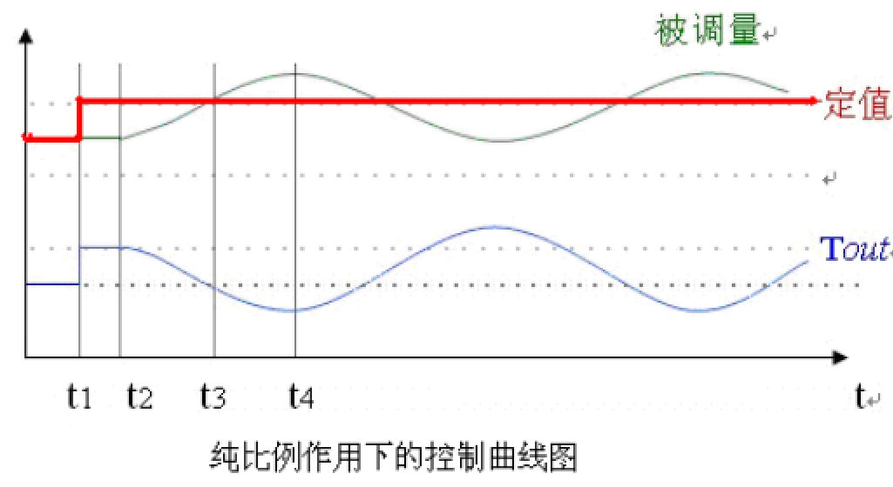
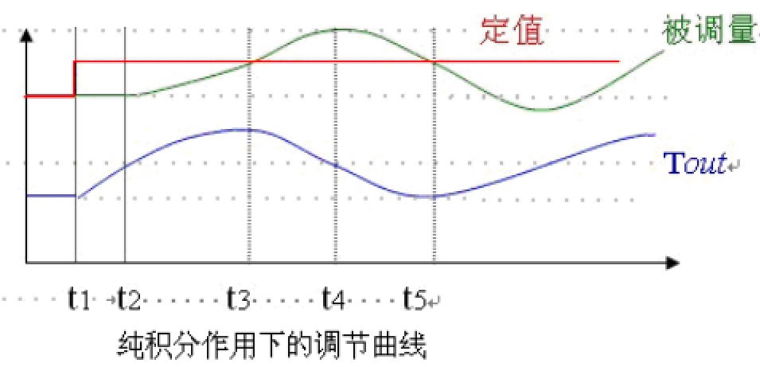
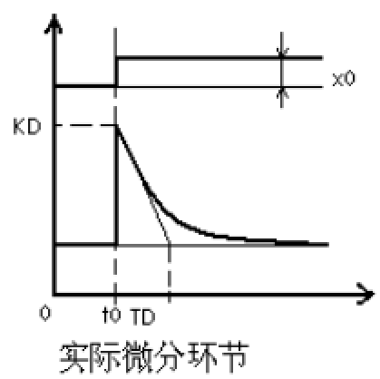
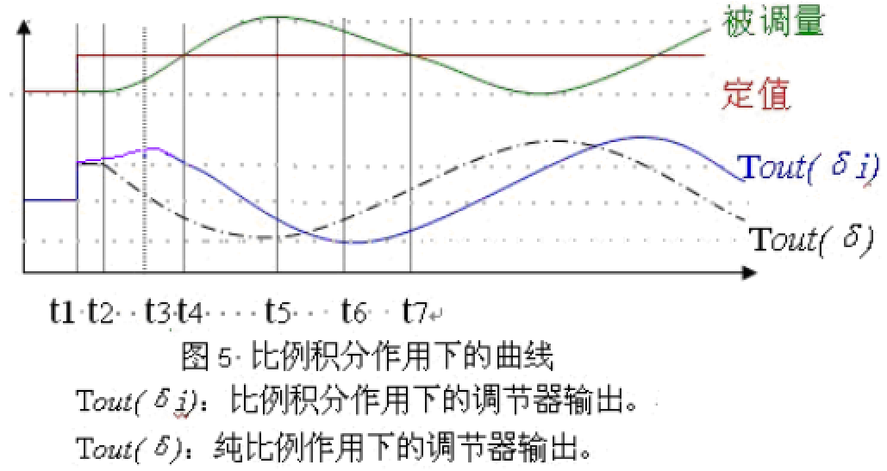
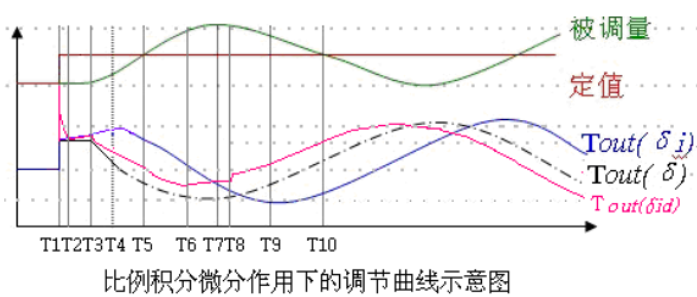

#PID学习
今天终于开始调试英雄机器人的云台电机了，我采用的是位置环和速度环的串级PID，也是首先的先调速度环，然后调位置环。方位角和角速度都是靠陀螺仪获取的。

按理说，我如果将位置环失效，只用速度环的话，那么我用手拨动云台，它应该立即停下来，速度减为0，并且基本无振荡。但是出师不利，今天调参已经自闭一天了，所以决定再次学习一下PID的调参和原理。

##PID调参口诀

>参数整定找最佳，从小到大顺序查。
先是比例后积分，最后再把微分加。
曲线振荡很频繁，比例度盘要放大。
曲线漂浮绕大弯，比例度盘往小扳。
曲线偏离回复慢，积分时间往下降。
曲线拨动周期长，积分时间再加长。
曲线振荡频率快，先把微分降下来。
动差大来波动慢，微分时间应加长。
理想曲线两个波，前高后低四比一。
一看二调多分析，调节质量不会低。

##什么是PID
P 就是比例，就是输入偏差乘以一个系数；
I 就是积分，就是对输入偏差进行积分运算；
D 就是微分，对输入偏差进行微分运算。

就是先把系统调为纯比例作用，然后增强比例作用让系统震荡，记录下比例作用和震荡周期，然后这个比例作用乘以 0.6，积分作用适当延长。

公式表达如下：
$$K_p = 0.6*K_m$$
$$K_d = \frac{K_p \pi}{4 \omega}$$
$$K_i = \frac{K_p \omega}{\pi}$$

其中：
$$K_p$$为比例控制参数
$$K_d$$为微分控制参数
$$K_i$$为积分控制参数
$$K_m$$为系统开始振荡时的比例值
$$\omega$$为极坐标下振荡时的频率

##要收集的曲线：

1. 设定值。作为比较判断依据；
2. 被调量波动曲线；
3. PID输出
4. 副调的被调量曲线；
5. PID输出曲线
> 主调：串级系统中，要调节被调量的那个PID叫做主调
副调：串级系统中，输出直接去指挥执行器动作的那个PID叫做副调。主调的输入进入副调座位副调的设定值。一般来说，主调为了调节被调量，副调为了消除干扰。

##P纯比例作用趋势图的特征分析
被调量变化多少，输出乘以比例系数的积就变化多少。或者说：被调量与输出的波形完全相似。

输出曲线和被调量曲线的推论：

1. 对于正作用的调节系统，顶点、谷底均发生在同一时刻
2. 对于负作用的调节系统，被调量的顶点就是输出的谷底，谷底就是输出的顶点。
3. 对于正作用的调节系统，被调量的曲线上升，输出曲线就上升；被调量曲线下降，输出曲线就下降。两者趋势完全一样。
4. 对于负作用的调节系统，被调量曲线和输出曲线相对。波动周期完全一致。
5. 只要被调量变化，输出就变化；被调量不变化，不管静态偏差有多大，输出也不会变化。

为了便于理解，把趋势图画出来分析：

##I纯积分作用趋势图的特征分析
一句话简述：如果调节器的输入偏差不等于0，就让调节器的输出按照一定的速度一直朝一个方向累加下去。

积分相当于一个斜率发生器，斜率的大小与两个参数有关：**输入偏差的大小**、**积分时间**。

单纯积分作用是没有实际意义的。单纯积分作用的特性总结如下：

1. 输出的升降与被调量的升降无关，与输入偏差的正负有关。
2. 输出的升降与被调量的大小无关。
3. 输出的斜率与被调量的大小有关。
4. 被调量不管怎么变化，输出始终不会出现阶跃扰动
5. 被调量达到顶点的时候，输出的变化趋势不变，速率开始减缓。
6. 输出曲线达到顶点的时候，必然是输入偏差等于0的时候

纯积分作用下的输出波形曲线：

##D纯微分作用趋势图的特征分析
单独的微分作用是不存在的。一句话简述：被调量不动，输出不动；被调量一动，输出马上跳。

微分作用的特点：
1. 微分作用于被调量的大小无关，与被调量的变化速率有关；
2. 与被调量的正负无关，与被调量的变化曲线趋势有关；
3. 如果被调量有一个阶跃，就相当于输入变化的速度无穷大，那么输出会直接到最小或者最大；
4. 微分参数有的是一个，用微分时间表示。有的分为两个：微分增益和微分时间。**微分增益表示输出波动的幅度，波动后还要输出回归，微分时间表示回归的快慢。**见下图，KD是微分增益，TD是微分时间。
5. 由第4条得出推论：波动调节之后，输出还会自动拐回头。

纯微分作用的输出效果如下：

微分作用能够超前调节。
##比例积分作用的特征曲线

判断$$t_6$$时刻的先后，或者说$$t_6$$距离$$t_5$$的时间，是判断积分作用强弱的标准。
##比例积分微分作用的特征曲线
增加微分功能后，调节曲线更复杂点，也更难理解点。如果把这一节真正掌握后，参数整定问题也就不算大了。

比例积分微分三个参数的大小都不是绝对的，都是相对的。
##整定参数的几个原则
把复杂的问题简单化，简单化有利于思路清晰。那么怎样孤立简化呢？

1. 把串级调节系统孤立成两个单回路。把主、副调隔离开来，来整定一个回路，再全面考虑；
2. 把相互耦合的系统解耦为几个独立的系统，在稳态下，进行参数判断。让各个系统之间互不干扰，然后再考虑耦合
3. 把P、I、D隔离开来，先去掉积分、微分作用，让系统变为纯比例调节方式，然后再考虑积分，然后再考虑微分

##整定比例带
比较笨的办法：逐渐加大比例作用，一直到系统发生等幅振荡，然后再这个基础上适当减少比例作用即可，或者把比例增益乘以0.6~0.8

最终所整定的系统，其调节效果应该是被调量波动小而平缓。**不管是被调量还是调节输出，其曲线都不应该有强烈的周期特征**。

能够通过整定参数解决的问题，最好不通过控制策略来解决。
##整定积分时间
**对于主调来说，主调的目的就是为了消除静态偏差**。如果能够消除静态偏差，积分作用就可以尽量的小。

再回过头看比例积分微分波形图：

$$t_6$$$过于靠近$$t_5$$，则积分作用过弱；过于靠近$$t_7$$，则积分作用过强。$$t_6$$所在的位置，应该在$$t_5$$和$$t_7$$之间的$$\frac{1}{3}$$靠前一点。

积分作用和比例作用使相对的，当比例作用强的时候，积分也可以随之增强；比例作用弱的时候，积分也必须随之下调。**积分作用只是辅助比例作用进行调节，它仅仅是为了消除静态偏差**
##整定微分作用
微分作用比较容易判断，那就是PID输出“毛刺”过多。

在微分增益增大的时候，一定要考虑到微分时间的调整，否则调节曲线上会有很多毛刺，毛刺直接影响执行机构的频繁动作，一般来说，它是有害的。

好的调节效果，往往在调节曲线上是看不到毛刺的，只可以在输出曲线上看到一个突出的陡升或者陡降。
##整定参数的几个认识误区
1、对微分的认识误区
认为微分就是超前调节，如果被调量或者测量值有滞后，就要加微分。微分是由超前调节的功能，但是微分作用有些地方不能用：测量值岑仔不间断的微小波动的时候，再加个微分，就会造成调节干扰，不如不要微分。

2、对积分的认识误区
有些人发现偏差就要调积分，偏差存在有可能是系统调节缓慢，比例作用也有可能影响，如果积分作用盖过了比例作用，那么这个系统就很难稳定。

3、主调快还是副调快
因系统而定，因参数而定。常规参数：主调的比例弱，积分强，以消除静差；副调的比例强，积分弱，以消除干扰。不绝对。