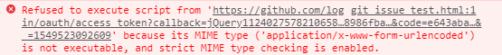
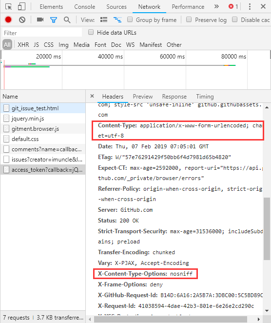

#GitHub你玩我
最近这几天一直在尝试使用GitHub的issue和comments来重构我的博客，这样可以给博客加上评论功能，而且还能自带提醒功能。

目前其实已经有gitment这个成熟的模块，但就在前不久作者的网站安全证书过期了，导致gitment服务出了问题。

于是我手动下载源代码，用node.js搭建了一个服务器，但是不知道为什么，在自己的电脑上没有任务问题，搬到服务器后，程序明明正在监听端口，我就是访问不了。

没办法，只剩下自己写了。

我参考了GitHub的[API](https://developer.github.com/v3)，申请了一个GitHub的OAuth应用，拿到了`client_id`和`client_secret`，然后参照[教程](https://segmentfault.com/a/1190000015144126?utm_source=tag-newest)一路走下来，似乎没啥问题，但是在尝试使用API添加comments的时候总是提示没有访问仓库的权限。

后来才发现原来申请code的时候要指定scope为public_repo，否则默认的就没有修改权限。

然后就剩下最后一个问题，就是获取access_token的时候的跨域访问的问题。我使用了jsonp实现跨域访问，response的数据也能在开发者工具中看到，但是一直有以下报错提示：

自闭了一下午也没有解决，后来我发现：

对于script脚本内容，MIME的范围是
- "application/ecmascript"
- "application/javascript"
- "application/x-javascript"
- "text/ecmascript"
- "text/javascript"
- "text/jscript"
- "text/x-javascript"
- "text/vbs"
- "text/vbscript"

但它自己又指定了返回的内容是`application/x-www-form-urlencoded`。

GitHub你玩我。。。。。简直无解。