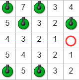
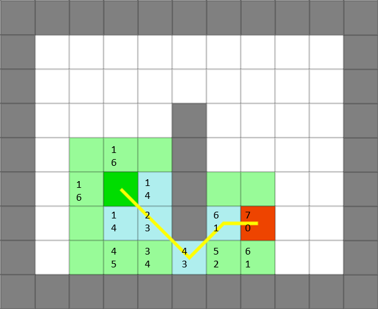

#寻路算法学习
前几天搞美赛，题目是怎么逃离卢浮宫最快，感觉应该是一个路径规划的问题。于是死磕了几天的寻路算法。

寻路算法主要见于即时战略游戏（RTS）中，分为静态路径寻路和动态路径寻路，这里只讨论静态寻路。

静态寻路算法中最常见的就是**A-Star算法**和**Dijkstra算法**，其中**A-Star算法**是基于**Dijkstra算法**的。

##Dijkstra算法
Dijkstra算法又称为最短路径算法，是由荷兰著名的计算机科学家Dijkstra提出来的。它是一种集中式的静态算法，用来求解图中指定节点到其他节点的最短距离。

Dijkstra算法的具体算法如下：

如下图，首先以终点（图中红圈处）为原点，然后访问四周相邻的方格，如果不是障碍块，则给改方格记录上从终点到达该方格的步数。接下来在此基础上进一步访问更多的方格，直至遍历完所有的方格。

可以查看这个[在线示例](https://howtorts.github.io/examples/2-dijkstra-path-building/)，如果没有蓝线则说明没有找到路径，刷新页面即可（因为障碍是随机生成的，不一定能找到路径）。
##A-Star算法
1968年，Hart，Nillsion等提出了基于启发式函数的最短寻路算法A-Star，用于解决静态路由网中的最短路径问题。它与Dijkstra算法同属于求最短路径搜索算法，但是A-Star算法使用了启发式信息，不会盲目的搜索路径，而是评估地图上任意点到目标点的费用，更好地选择搜索方向，优先搜索最有希望的节点。A-Star算法通过估价函数（Heuristic Function）$$f(h)$$来估计图中的当前点S到目标点G的距离，并由此决定它的搜索方向，其公式表示为：

$$f(n)=h(n)+g(n)$$

其中$$n$$代表地图上的某个节点，$$g(n)$$是从起始点S到当前节点n的实际花费，$$h(n)$$为当前节点$$n$$到目标节点的最佳路径代价估计，用于估计当前节点到目标节点的最佳距离，而并非是实际的距离，估计得时候并不需要考虑地图中的障碍物的存在。常用的距离估计有：曼哈顿距离、欧几里得距离、平方欧式距离、对角距离等。不同的估计方法使用与不同的地图场景中，这也是A-Star算法的一大缺点，如果估计方法选择的不对，那么可能找不出最短路径。

上图展示的是一个使用A-Star算法计算出的最短路径，方格中有两个数字，第一个数字$$g(n)$$，第二个数字是$$h(n)$$，从上图可以清晰地看出A-Star算法的工作过程。

关于A-Star算法的讲解，这个网址讲解的非常详细：
[Introduction to the A* Algorithm](https://www.redblobgames.com/pathfinding/a-star/introduction.html)

最后贴上一些在线示例，这些示例全部来自博客[How To RTS](https://howtorts.github.io/)

[最基本的Dijkstra算法查找的路径](https://howtorts.github.io/examples/2-dijkstra-path-building/)
[基本的Flow Field模型](https://howtorts.github.io/examples/5-flow-field-improvements/index.html)
[加入物理引擎BOX2D后的Flow Field模型](https://howtorts.github.io/examples/6-physics/index.html)
[加入Continuum Crowds后的模型](https://howtorts.github.io/examples/8-1-crossing-groups-continuum-crowds/)